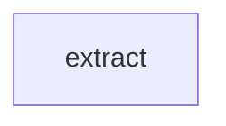

# Quickstart

Get a working extraction pipeline in under 5 minutes.

## Install

```bash
pip install pyconveyor
```

For Anthropic support:

```bash
pip install "pyconveyor[anthropic]"
```

---

## Option A — Interactive setup (recommended for new users)

The interactive setup guides you through defining your schema and choosing a provider. No Python files needed.

```bash
pyconveyor init my_pipeline/ --interactive
cd my_pipeline/
```

You'll be asked:

1. **What are you extracting from?** (e.g. `papers`, `articles`) — used as a label
2. **Output fields** — one per line, in `name:type` format:
   ```
   > title:str
   > authors:list[str]
   > doi:str | None
   > publication_year:int
   >              ← press Enter to finish
   ```
3. **Which LLM provider?** — OpenAI, Anthropic, or Ollama

This generates a `pipeline.yaml` with an inline schema:

```yaml
models:
  default:
    provider: openai_compat
    api_key:  ${OPENAI_API_KEY}
    model:    ${MODEL_NAME:-gpt-4o-mini}
    timeout:  120

steps:
  - name: extract
    type: llm
    model: default
    prompt: prompts/extract.j2
    schema:
      title: str
      authors: list[str]
      doi: str | None
      publication_year: int
    max_attempts: 3
```

No `schemas.py` file. The schema lives in the YAML.

You can add descriptions to any field — they are injected into the LLM prompt automatically via `{{ schema_hint }}`:

```yaml
    schema:
      title:
        type: str
        description: "Paper title exactly as written, including subtitle."
      authors:
        type: list[str]
        description: "All author names in order, with affiliations."
        min_items: 1
      doi:
        type: str | None
        description: "DOI if present. Null if not found."
        pattern: "^10\\.[0-9]{4,}/.+$"
      publication_year:
        type: int
        description: "Four-digit year of publication."
```

See the **[YAML Schema guide](guides/yaml-schema.md)** for field constraints, nested objects, and `on_fail` behaviour.

---

## Option B — Static setup

If you prefer the traditional layout with a `schemas.py` file:

```bash
pyconveyor init my_pipeline/
cd my_pipeline/
```

This creates:

```
my_pipeline/
├── pipeline.yaml          # pipeline spec
├── prompts/
│   └── extract.j2         # example prompt template
├── schemas.py             # example Pydantic schema
├── steps.py               # example step functions
├── pyconveyor-schema.json # JSONSchema for editor autocomplete
└── .vscode/
    └── settings.json      # editor autocomplete config
```

---

## Set your API key

```bash
export OPENAI_API_KEY=sk-...

# For local models (Ollama):
export OPENAI_BASE_URL=http://localhost:11434/v1
export OPENAI_API_KEY=ollama

# For Anthropic:
export ANTHROPIC_API_KEY=sk-ant-...
```

---

## Run

```bash
pyconveyor run pipeline.yaml --input '{"paper": "Smith et al. (2024) demonstrate that CRISPR-Cas9 gene editing achieves 94% efficiency in primary human T cells."}'
```

Output:

```json
{
  "steps": {
    "extract": {
      "title": "CRISPR-Cas9 Gene Editing in Primary Human T Cells",
      "authors": ["J. Smith", "A. Chen", "M. Patel"],
      "doi": "10.1038/s41586-024-01234",
      "publication_year": 2024
    }
  },
  "summary": {
    "steps_run": ["extract"],
    "steps_skipped": [],
    "llm_calls": 1,
    "elapsed_seconds": 1.23
  }
}
```

---

## Validate without running

```bash
pyconveyor validate pipeline.yaml
# ✓ pipeline.yaml is valid
```

Catches all errors — bad field names, missing imports, invalid expressions — before spending any tokens.

---

## Visualise the pipeline

```bash
pyconveyor visualise pipeline.yaml
```



For multi-step pipelines this shows the full step DAG. Paste it into GitHub, GitLab, or Notion for a rendered diagram.

---

## Process a file with Python

```python
from pyconveyor import PipelineRunner

runner = PipelineRunner("my_pipeline/pipeline.yaml")
result = runner.run({"paper": "Full text of the paper…"})

if result.failed:
    print("Failed at step:", result.failure_state.step_name)
    print("Error:", result.failure_state.exception)
else:
    extraction = result.steps["extract"].value
    print(extraction)  # dict (or Pydantic model if schemas.py is used)
```

---

## Process many documents at once

```bash
# input.jsonl — one paper per line
echo '{"id": "1", "paper": "Smith et al. demonstrate..."}' >> input.jsonl
echo '{"id": "2", "paper": "Chen et al. report..."}' >> input.jsonl

pyconveyor batch pipeline.yaml --input input.jsonl --output results.jsonl --workers 8
```

---

## Measure accuracy with benchmarking

Once you have some papers with known-correct outputs, benchmark your pipeline:

```bash
# Create a benchmark case
mkdir -p benchmarks/paper_001
cat > benchmarks/paper_001/input.yaml << 'EOF'
paper: "Smith et al. (2024) demonstrate that CRISPR-Cas9 gene editing achieves 94% efficiency in primary human T cells."
EOF
cat > benchmarks/paper_001/expected.yaml << 'EOF'
extract:
  title: "CRISPR-Cas9 Gene Editing in Primary Human T Cells"
  authors: ["J. Smith", "A. Chen", "M. Patel"]
  doi: "10.1038/s41586-024-01234"
EOF

# Run the benchmark
pyconveyor benchmark benchmarks/ --pipeline pipeline.yaml --report report.html
open report.html
```

See the [Benchmarking guide](guides/benchmarking.md) for details.
JSON benchmark files are also supported (`input.json` and `expected.json`).

---

## Next steps

- [Concepts](concepts.md) — understand how pipelines, steps, and context fit together
- [Step Types](guides/step-types.md) — add `transform`, `validate`, `parallel`, and `condition` steps
- [Validation Feedback](guides/validation-feedback.md) — how self-correcting retries work
- [Benchmarking](guides/benchmarking.md) — measure and improve pipeline accuracy
- [YAML Schema](reference/schema.md) — full field reference
- [CLI Reference](reference/cli.md) — all commands and options
