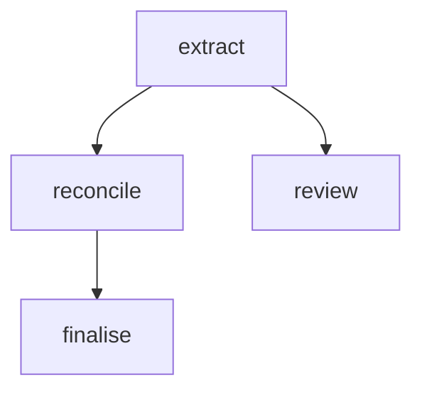

# CLI Reference

pyconveyor ships a CLI with six subcommands.

```
pyconveyor <command> [options]
```

---

## `pyconveyor init`

Bootstrap a new pipeline directory.

```bash
pyconveyor init [directory]
```

**Arguments:**

| Argument | Default | Description |
|---|---|---|
| `directory` | `.` (current directory) | Target directory to create files in |

**Creates:**

| File | Description |
|---|---|
| `pipeline.yaml` | Minimal one-step pipeline |
| `prompts/extract.j2` | Example Jinja2 prompt template |
| `schemas.py` | Example Pydantic schema |
| `steps.py` | Example step function file |
| `pyconveyor-schema.json` | JSONSchema for editor autocomplete |
| `.vscode/settings.json` | VS Code YAML schema mapping |
| `.gitignore` | Entries for `.pyconveyor-cache/` and `.env` |

Existing files are not overwritten.

**Example:**

```bash
pyconveyor init my_pipeline/
cd my_pipeline/
export OPENAI_API_KEY=sk-...
pyconveyor run pipeline.yaml --input '{"document": "Hello world"}'
```

---

## `pyconveyor run`

Run a pipeline with JSON input.

```bash
pyconveyor run <pipeline> [options]
```

**Arguments:**

| Argument | Description |
|---|---|
| `pipeline` | Path to the pipeline YAML file |

**Options:**

| Option | Default | Description |
|---|---|---|
| `--input`, `-i` | `-` (stdin) | Input JSON: a file path, `-` for stdin, or an inline JSON string starting with `{` or `[` |
| `--output`, `-o` | stdout | Output file path. If omitted, JSON is printed to stdout |
| `--dry-run` | off | Validate and run the pipeline with LLM steps returning `None` |
| `--no-cache` | off | Bypass the development response cache |
| `--refresh-cache` | off | Ignore cached responses and overwrite them with fresh results |
| `--verbose`, `-v` | off | Set log level to `DEBUG` (full prompts and responses) |
| `--quiet`, `-q` | off | Set log level to `ERROR` (suppress all but fatal errors) |

**Input forms:**

```bash
# From a file
pyconveyor run pipeline.yaml --input input.json

# From stdin
echo '{"document": "text"}' | pyconveyor run pipeline.yaml

# Inline JSON string
pyconveyor run pipeline.yaml --input '{"document": "text"}'
```

**Output format:**

```json
{
  "steps": {
    "extract": {
      "title": "Example",
      "key_points": ["Point one"]
    }
  },
  "summary": {
    "steps_run": ["extract"],
    "steps_skipped": [],
    "llm_calls": 1,
    "elapsed_seconds": 1.23
  }
}
```

**Exit codes:**

| Code | Meaning |
|---|---|
| `0` | Pipeline succeeded |
| `1` | Invalid input JSON or startup error |
| `2` | Pipeline failed (a required step exhausted retries) |

---

## `pyconveyor batch`

Process a JSONL input file through a pipeline with parallel workers.

```bash
pyconveyor batch <pipeline> [options]
```

**Arguments:**

| Argument | Description |
|---|---|
| `pipeline` | Path to the pipeline YAML file |

**Options:**

| Option | Default | Description |
|---|---|---|
| `--input`, `-i` | `-` (stdin) | JSONL file — one JSON object per line — or `-` for stdin |
| `--output`, `-o` | stdout | Output JSONL file. If omitted, results are printed to stdout |
| `--workers`, `-w` | `4` | Number of parallel worker threads |
| `--key`, `-k` | `id` | Field name used as the item identifier in output |
| `--no-progress` | off | Suppress the tqdm progress bar |
| `--no-cache` | off | Bypass the development response cache |
| `--dry-run` | off | Skip LLM calls; returns `null` for all step results |

**Input format:**

One JSON object per line (JSONL / newline-delimited JSON):

```jsonl
{"id": "doc-1", "text": "First document"}
{"id": "doc-2", "text": "Second document"}
{"id": "doc-3", "text": "Third document"}
```

**Output format:**

One JSON result per line, in completion order (not submission order):

```jsonl
{"id": "doc-2", "ok": true, "steps": {"extract": {"title": "..."}}}
{"id": "doc-1", "ok": true, "steps": {"extract": {"title": "..."}}}
{"id": "doc-3", "ok": false, "error": "Pipeline aborted at step 'extract': ..."}
```

**Exit codes:**

| Code | Meaning |
|---|---|
| `0` | Batch completed (individual items may have failed — check `"ok"` field) |
| `1` | Input error (invalid JSONL, empty file) |

**Example:**

```bash
# Process 1000 documents with 8 workers, saving to results.jsonl
pyconveyor batch pipeline.yaml \
  --input documents.jsonl \
  --output results.jsonl \
  --workers 8

# Pipe from a generator
generate-docs | pyconveyor batch pipeline.yaml --output results.jsonl
```

---

## `pyconveyor validate`

Validate a pipeline YAML file without running it.

```bash
pyconveyor validate <pipeline>
```

**Arguments:**

| Argument | Description |
|---|---|
| `pipeline` | Path to the pipeline YAML file |

Runs all load-time checks:

- All `fn:` and `schema:` references are importable
- All `model:` references exist in the `models:` block
- All `{{ expr }}` expressions pass the AST whitelist
- Required fields are present on every step
- No duplicate step names

**Output (success):**

```
✓ pipeline.yaml is valid
```

**Output (failure):**

```
Validation error:
pipeline.yaml:34  steps[2].inputs.primary
  Expression error: 'step' is not a valid root.
  Did you mean: 'steps'?
```

**Exit codes:**

| Code | Meaning |
|---|---|
| `0` | Pipeline is valid |
| `1` | Validation errors found |

---

## `pyconveyor schema`

Emit the JSONSchema for the pipeline YAML format.

```bash
pyconveyor schema [--indent N]
```

**Options:**

| Option | Default | Description |
|---|---|---|
| `--indent` | `2` | JSON indentation level |

**Usage:**

```bash
pyconveyor schema > pyconveyor-schema.json
```

Point your editor at this file for autocomplete. See [Editor Setup](../guides/editor-setup.md).

---

## `pyconveyor visualise`

Generate a Mermaid DAG diagram of the pipeline.

```bash
pyconveyor visualise <pipeline> [--output file]
# alias: pyconveyor visualize
```

**Arguments:**

| Argument | Description |
|---|---|
| `pipeline` | Path to the pipeline YAML file |

**Options:**

| Option | Default | Description |
|---|---|---|
| `--output`, `-o` | stdout | Output Markdown file. If omitted, printed to stdout |

**Output format:**

A Markdown file containing a fenced Mermaid diagram:

````markdown
# Pipeline DAG


````

Paste into any Markdown renderer that supports Mermaid (GitHub, GitLab, Notion, Obsidian) to visualise the step graph.

**From Python:**

```python
from pyconveyor import generate_mermaid

diagram = generate_mermaid("pipeline.yaml")
print(diagram)
```
