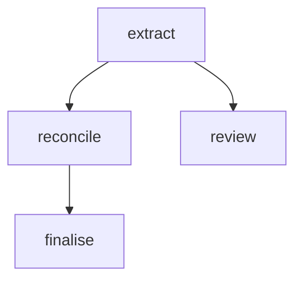

# CLI Reference

pyconveyor ships a CLI with eight subcommands.

```
pyconveyor <command> [options]
```

---

## `pyconveyor init`

Bootstrap a new pipeline directory.

```bash
pyconveyor init [directory] [--interactive]
```

**Arguments:**

| Argument | Default | Description |
|---|---|---|
| `directory` | `.` (current directory) | Target directory to create files in |

**Options:**

| Option | Description |
|---|---|
| `--interactive`, `-i` | Guided setup — define fields and choose provider interactively |

**Default (non-interactive):**

```bash
pyconveyor init my_pipeline/
```

Creates:

| File | Description |
|---|---|
| `pipeline.yaml` | Minimal one-step pipeline |
| `prompts/extract.j2` | Example Jinja2 prompt template |
| `schemas.py` | Example Pydantic schema |
| `steps.py` | Example step function file |
| `vocabularies/` | Empty vocabulary directory |
| `pyconveyor-schema.json` | JSONSchema for editor autocomplete |
| `.vscode/settings.json` | VS Code YAML schema mapping |
| `.gitignore` | Entries for `.pyconveyor-cache/` and `.env` |

Existing files are not overwritten.

**Interactive mode:**

```bash
pyconveyor init my_pipeline/ --interactive
```

Prompts you for:

1. What you're extracting from (e.g. "invoices", "articles")
2. Output fields — one per line in `name:type` format
3. Which LLM provider (OpenAI, Anthropic, or Ollama)

Produces a `pipeline.yaml` with an **inline YAML schema** instead of a `schemas.py` file — no Python import needed.

> **Screenshot placeholder:** terminal showing the interactive prompts and resulting pipeline.yaml with inline schema.

Supported field types: `str`, `int`, `float`, `bool`, `list[str]`, `list[int]`, `list[float]`, `dict[str,str]`. Append `| None` to make any field optional.

**Examples:**

```bash
# Non-interactive
pyconveyor init my_pipeline/
cd my_pipeline/
export OPENAI_API_KEY=sk-...
pyconveyor run pipeline.yaml --input '{"document": "Hello world"}'

# Interactive
pyconveyor init invoice_extractor/ --interactive
```

---

## `pyconveyor run`

Run a pipeline with JSON input.

```bash
pyconveyor run <pipeline> [options]
```

**Arguments:**

| Argument | Description |
|---|---|
| `pipeline` | Path to the pipeline YAML file |

**Options:**

| Option | Default | Description |
|---|---|---|
| `--input`, `-i` | `-` (stdin) | Input JSON: a file path, `-` for stdin, or an inline JSON string starting with `{` or `[` |
| `--output`, `-o` | stdout | Output file path. If omitted, JSON is printed to stdout |
| `--dry-run` | off | Validate and run the pipeline with LLM steps returning `None` |
| `--no-cache` | off | Bypass the development response cache |
| `--refresh-cache` | off | Ignore cached responses and overwrite them with fresh results |
| `--verbose`, `-v` | off | Set log level to `DEBUG` (full prompts and responses) |
| `--quiet`, `-q` | off | Set log level to `ERROR` (suppress all but fatal errors) |

**Input forms:**

```bash
# From a file
pyconveyor run pipeline.yaml --input input.json

# From stdin
echo '{"document": "text"}' | pyconveyor run pipeline.yaml

# Inline JSON string
pyconveyor run pipeline.yaml --input '{"document": "text"}'
```

**Output format:**

```json
{
  "steps": {
    "extract": {
      "title": "Example",
      "key_points": ["Point one"]
    }
  },
  "summary": {
    "steps_run": ["extract"],
    "steps_skipped": [],
    "llm_calls": 1,
    "elapsed_seconds": 1.23
  }
}
```

**Exit codes:**

| Code | Meaning |
|---|---|
| `0` | Pipeline succeeded |
| `1` | Invalid input JSON or startup error |
| `2` | Pipeline failed (a required step exhausted retries) |

---

## `pyconveyor batch`

Process a JSONL input file through a pipeline with parallel workers.

```bash
pyconveyor batch <pipeline> [options]
```

**Arguments:**

| Argument | Description |
|---|---|
| `pipeline` | Path to the pipeline YAML file |

**Options:**

| Option | Default | Description |
|---|---|---|
| `--input`, `-i` | `-` (stdin) | JSONL file — one JSON object per line — or `-` for stdin |
| `--output`, `-o` | stdout | Output JSONL file. If omitted, results are printed to stdout |
| `--workers`, `-w` | `4` | Number of parallel worker threads |
| `--key`, `-k` | `id` | Field name used as the item identifier in output |
| `--no-progress` | off | Suppress the tqdm progress bar |
| `--no-cache` | off | Bypass the development response cache |
| `--dry-run` | off | Skip LLM calls; returns `null` for all step results |

**Input format:**

One JSON object per line (JSONL / newline-delimited JSON):

```jsonl
{"id": "doc-1", "text": "First document"}
{"id": "doc-2", "text": "Second document"}
{"id": "doc-3", "text": "Third document"}
```

**Output format:**

One JSON result per line, in completion order (not submission order):

```jsonl
{"id": "doc-2", "ok": true, "steps": {"extract": {"title": "..."}}}
{"id": "doc-1", "ok": true, "steps": {"extract": {"title": "..."}}}
{"id": "doc-3", "ok": false, "error": "Pipeline aborted at step 'extract': ..."}
```

**Exit codes:**

| Code | Meaning |
|---|---|
| `0` | Batch completed (individual items may have failed — check `"ok"` field) |
| `1` | Input error (invalid JSONL, empty file) |

**Examples:**

```bash
# Process 1000 documents with 8 workers, saving to results.jsonl
pyconveyor batch pipeline.yaml \
  --input documents.jsonl \
  --output results.jsonl \
  --workers 8

# Pipe from a generator
generate-docs | pyconveyor batch pipeline.yaml --output results.jsonl
```

---

## `pyconveyor validate`

Validate a pipeline YAML file without running it.

```bash
pyconveyor validate <pipeline>
```

**Arguments:**

| Argument | Description |
|---|---|
| `pipeline` | Path to the pipeline YAML file |

Runs all load-time checks:

- All `fn:` and `schema:` references are importable
- All `model:` references exist in the `models:` block
- All `{{ expr }}` expressions pass the AST whitelist
- Required fields are present on every step
- No duplicate step names

**Output (success):**

```
✓ pipeline.yaml is valid
```

**Output (failure):**

```
Validation error:
pipeline.yaml:34  steps[2].inputs.primary
  Expression error: 'step' is not a valid root.
  Did you mean: 'steps'?
```

**Exit codes:**

| Code | Meaning |
|---|---|
| `0` | Pipeline is valid |
| `1` | Validation errors found |

---

## `pyconveyor schema`

JSONSchema utilities — emit the pipeline schema or infer a Pydantic schema from sample output.

### `pyconveyor schema emit`

Emit the JSONSchema for the pipeline YAML format.

```bash
pyconveyor schema [emit] [--indent N]
```

`emit` is the default subcommand — `pyconveyor schema` and `pyconveyor schema emit` are equivalent.

**Options:**

| Option | Default | Description |
|---|---|---|
| `--indent` | `2` | JSON indentation level |

**Usage:**

```bash
pyconveyor schema > pyconveyor-schema.json
```

Point your editor at this file for autocomplete. See [Editor Setup](../guides/editor-setup.md).

### `pyconveyor schema infer`

Infer a `schemas.py` stub from a sample of JSON output.

```bash
pyconveyor schema infer <pipeline> --sample <file> [options]
```

**Arguments:**

| Argument | Description |
|---|---|
| `pipeline` | Path to the pipeline YAML file (used to name the generated class) |

**Options:**

| Option | Default | Description |
|---|---|---|
| `--sample` | — (required) | Path to a `.json` or `.jsonl` sample file |
| `--step` | first `llm` step | Step name to infer the schema for; controls the generated class name |
| `--output`, `-o` | stdout | Output file path; if omitted, printed to stdout |

**Example:**

```bash
# Run the pipeline once and save the output
pyconveyor run pipeline.yaml --input input.json > sample_output.json

# Infer a schemas.py from that output
pyconveyor schema infer pipeline.yaml --sample sample_output.json --output schemas.py
```

Generated `schemas.py`:

```python
from pydantic import BaseModel
from typing import Optional

class Extract(BaseModel):
    invoice_number: str
    vendor: str
    amount: float
    due_date: Optional[str] = None
```

**Notes:**

- Field types are inferred from the JSON values in the sample. All fields are marked optional if the value is `null`.
- JSON keys that are not valid Python identifiers (e.g. `my-field`, `123abc`) are sanitised automatically.
- YAML reserved words used as field names (e.g. `yes`, `null`) raise a clear error instead of generating broken Python.
- If the sample is a JSONL file with multiple records, only the first record is used.

---

## `pyconveyor benchmark`

Run pipeline cases against golden-standard expected outputs and generate an HTML report.

```bash
pyconveyor benchmark <benchmark_dir> --pipeline <pipeline.yaml> [options]
```

**Arguments:**

| Argument | Description |
|---|---|
| `benchmark_dir` | Directory containing benchmark case subdirectories |

Each case subdirectory must contain `input.json` and `expected.json`. See the [Benchmarking guide](../guides/benchmarking.md) for the full format.

**Options:**

| Option | Default | Description |
|---|---|---|
| `--pipeline`, `-p` | — (required) | Pipeline YAML to benchmark. Repeat for multiple pipelines |
| `--report`, `-r` | `benchmark_report.html` | Output HTML report path |
| `--pdf` | off | Also export a PDF alongside the HTML (requires WeasyPrint) |
| `--pass-threshold` | `1.0` | Minimum per-case score to count as a pass |
| `--sections` | all except `attempt_logs` | Comma-separated list of sections to include in the report |
| `--title` | `Pipeline Benchmark Report` | Report title |

**Available sections:**

| Section | Description |
|---|---|
| `overall_summary` | Summary table: accuracy and pass rate per pipeline |
| `per_step_accuracy` | Per-step accuracy table across all cases |
| `pipeline_comparison` | Delta table (only shown with ≥2 pipelines) |
| `mermaid_graph` | Pipeline DAG with accuracy percentages on each node |
| `plots` | Bar charts of per-step accuracy per pipeline |
| `per_case_breakdown` | Collapsible per-case, per-step, per-field scores |
| `attempt_logs` | Raw LLM attempt logs (excluded by default) |

**Examples:**

```bash
# Basic single-pipeline benchmark
pyconveyor benchmark benchmarks/ \
  --pipeline pipeline.yaml \
  --report report.html

# Compare two pipelines with custom threshold
pyconveyor benchmark benchmarks/ \
  --pipeline pipeline_v1.yaml \
  --pipeline pipeline_v2.yaml \
  --pass-threshold 0.8 \
  --title "Invoice extraction: v1 vs v2" \
  --report comparison.html

# Shareable summary (no raw logs or per-case detail)
pyconveyor benchmark benchmarks/ \
  --pipeline pipeline.yaml \
  --sections overall_summary,per_step_accuracy,plots \
  --report summary.html

# Full report including attempt logs, also export PDF
pyconveyor benchmark benchmarks/ \
  --pipeline pipeline.yaml \
  --sections overall_summary,per_step_accuracy,pipeline_comparison,mermaid_graph,plots,per_case_breakdown,attempt_logs \
  --pdf \
  --report full.html
```

**Exit codes:**

| Code | Meaning |
|---|---|
| `0` | Benchmark completed (individual cases may have errors) |
| `1` | Benchmark directory not found or no pipelines specified |

**Console output:**

```
Benchmark complete — 10 cases
  pipeline.yaml: mean=87%  pass=60%  errors=0/10

Report written to: report.html
```

See the full [Benchmarking guide](../guides/benchmarking.md) for details on the expected output format, scoring, custom comparators, and the Python API.

---

## `pyconveyor visualise`

Generate a Mermaid DAG diagram of the pipeline.

```bash
pyconveyor visualise <pipeline> [--output file]
# alias: pyconveyor visualize
```

**Arguments:**

| Argument | Description |
|---|---|
| `pipeline` | Path to the pipeline YAML file |

**Options:**

| Option | Default | Description |
|---|---|---|
| `--output`, `-o` | stdout | Output Markdown file. If omitted, printed to stdout |

**Output format:**

A Markdown file containing a fenced Mermaid diagram:

````markdown
# Pipeline DAG


````

Paste into any Markdown renderer that supports Mermaid (GitHub, GitLab, Notion, Obsidian) to visualise the step graph.

**From Python:**

```python
from pyconveyor import generate_mermaid

diagram = generate_mermaid("pipeline.yaml")
print(diagram)

# With benchmark accuracy annotations
from pyconveyor import generate_mermaid
diagram = generate_mermaid("pipeline.yaml", step_scores={"extract": 0.875, "classify": 0.91})
print(diagram)
```

---

## `pyconveyor vocab review`

Interactively review pending vocabulary suggestions from a pipeline run.

```bash
pyconveyor vocab review <pipeline> [--auto-accept]
```

**Arguments:**

| Argument | Description |
|---|---|
| `pipeline` | Path to the pipeline YAML file |

**Options:**

| Option | Description |
|---|---|
| `--auto-accept` | Accept all pending suggestions without prompting (useful in CI) |

The command reads the `vocabularies:` block from the pipeline YAML, locates the vocabulary files, and presents each pending suggestion with:

- The raw value the LLM proposed
- How many times it has been seen
- The match type (`novel` or `fuzzy`)
- The ideal (unconstrained) value, if `capture_ideal: true` was set

**Interactive prompt:**

```
Vocabulary: labels
Description: Document classification labels for invoice processing
Known terms: invoice, receipt, statement
Pending suggestions (2):
  1. 'purchase order' — novel (seen 3×)
  2. 'remittance' — novel (seen 1×)

Enter numbers to accept (comma-separated), 'd<numbers>' to deny, or Enter to skip.
> 1 d2
  ✓ Added 'purchase order' to labels
  ✗ Denied 'remittance' in labels
  Saved vocabularies/labels.yaml
```

See the [Vocabulary Fields guide](../guides/vocab.md) for how to configure vocabularies in your pipeline.
